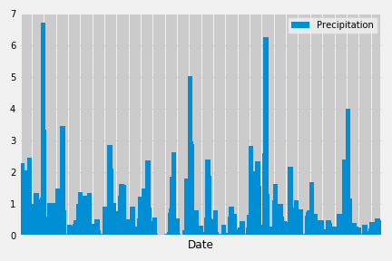
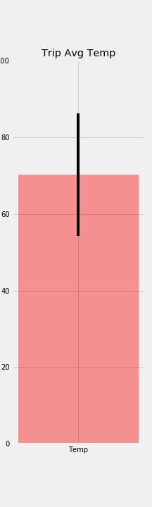

# Hawaii Weather API and Analysis
This project takes some Hawaii climate data and performs analysis on it as well as creating a simple API using flask to pull the data from an sqllite file and return it to a user.

#### -- Project Status: [Completed]

### Technologies
* Python
* SQLAlchemy
* Pandas, Matplotlib, jupyter notebook
* HTML
* Flask
* SQLlite

## Description
### API
The Hawaii_Weather_API.py file is a simple flask API. Using the Python library [SQLAlchemy](https://www.sqlalchemy.org/), it pull data from an SQLlite file and presents it to the end user in json format.  There are various API routes to retrieve different data.  The routes are listed on the initial page when the flask app opens.
### Analysis
Analysis was performed on Hawaii climate data in the jupyter notebook file.  Pandas was used to format the data while Matplotlib was used to visualize it.  The following plots were made:
#### 12 Month Precipitation Data

#### 12 Month Temperature Data

#### Average Trip Temperature Data (For a Specified Data Range)

